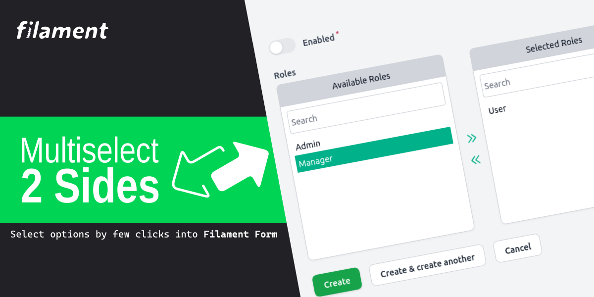
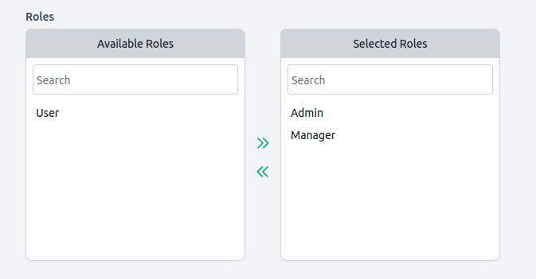

# Filament Multiselect Two Sides

[](https://packagist.org/packages/lucasgiovanny/filament-multiselect-two-sides)
[](https://packagist.org/packages/lucasgiovanny/filament-multiselect-two-sides)


This package is a Filament plugin that allows you to create a multiselect with 
two sides.




### Example


## Installation

You can install the package via composer:

```bash
composer require lucasgiovanny/filament-multiselect-two-sides
```

Optionally, you can publish the translations:

```bash
php artisan vendor:publish --tag="filament-multiselect-two-sides-translations"
```

## Usage

```php
use LucasGiovanny\FilamentMultiselectTwoSides\Forms\Components\Fields\MultiselectTwoSides;

return $form
    ->schema([
        MultiselectTwoSides::make('roles')
            ->options([
                'admin'   => 'Admin',
                'manager' => 'Manager',
                'user'    => 'User',
            ]),
    ]);

```

### Setting labels

```php
MultiselectTwoSides::make('roles')
    ->options([
        
        'admin'   => 'Admin',
        'manager' => 'Manager',
        'user'    => 'User',
    ]
    ])
    ->selectableLabel('Available Roles')
    ->selectedLabel('Selected Roles'),
```

### Enabling the search

By default, the search is disabled. To enable it, use the `enableSearch` method.

```php
MultiselectTwoSides::make('roles')
    ->options([
        'admin'   => 'Admin',
        'manager' => 'Manager',
        'user'    => 'User',
    ])
    ->enableSearch(),
```

### Setting the default selected options

```php
MultiselectTwoSides::make('roles')
    ->options([
        'admin'   => 'Admin',
        'manager' => 'Manager',
        'user'    => 'User',
    ])
    ->default(['admin', 'manager']),
```

## Changelog

Please see [CHANGELOG](CHANGELOG.md) for more information on what has changed recently.

## Contributing

Please see [CONTRIBUTING](.github/CONTRIBUTING.md) for details.

## Security Vulnerabilities

Please review [our security policy](./.github/SECURITY.md) on how to report security vulnerabilities.

## License

The MIT License (MIT). Please see [License File](LICENSE.md) for more information.
